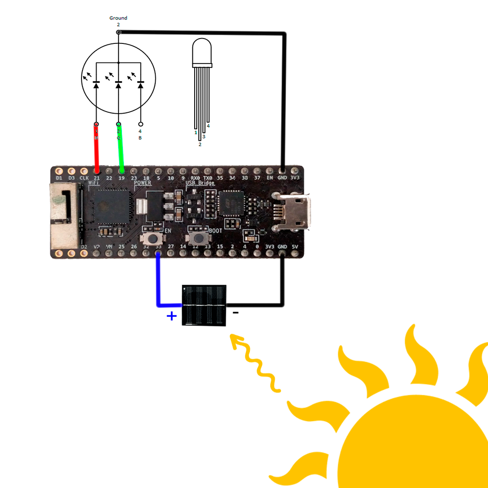
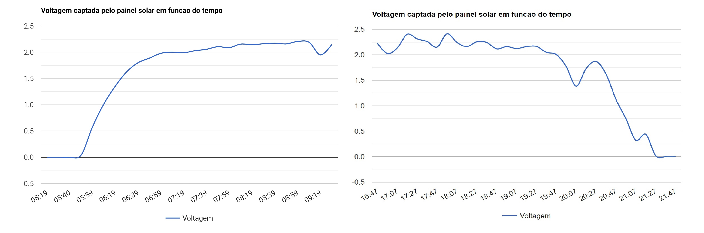

# Aquisição de dados de uma célula fotovoltaica
## Sumário
Neste projeto criamos um sistema baseado no microcontrolador esp32 pico kit que nos permite adquirir tensão de uma pequena célula fotovoltaica proveniente de um candeeiro de jardim. Este é capaz de criar um websocket onde podemos ver uma representação gráfica de pontos adquiridos de 10 em 10 minutos. Para além disto, o microcontrolador também está conectado um led RGB cuja intensidade dos díodos vermelho e verde nos indica a tensão em tempo real.
## Arquitetura 
O nosso sistema é composto pelo esp32, um led RGB e a célula fotovoltaica dispostos da seguinte forma: 

## ADC
Verificamos utilizando um multímetro que as tensões e correntes rondam os 2.5V e 15μA. Sabemos que estes valores são seguros para utilizar no adc da esp32[1], logo prosseguimos com o projeto. Implementamos o módulo "ADC" do micropython[2] e, como a tensão máxima ronda os 2.5V, escolhemos a atenuação de 11dB que nos permite obter valores até 3.6V. Para além disso fizemos leituras de 12bits para obter uma resolução maior.

## Websocket e gráfico
Utilizamos o módulo "network"[3] para conectar o esp32 à internet e o módulo "MicroWebSrv2"[4] para criar o websocket. 
Para representar graficamente os dados recebidos pelo adc em função do tempo necessitamos de informação da hora a que a medição foi feita. Para tal, utilizamos um api que fazendo um request retorna a hora atual e completamos assim os nossos dados[5]. 
Para o gráfico em si, utilizamos o "google charts"[6] e javascript. Assim, acedendo ao websocket podemos observar graficamente a intensidade solar captada pela célula ao longo do tempo. As medições são feitas de 10 em 10 minutos e temos como exemplo gráficos obtidos de manhã e ao fim da tarde:

## LED RGB 
Implementamos também um LED RGB como indicador em tempo real da tensão na célula fotovoltaica. Este apresenta uma cor verde se a tensão estiver próxima dos 2.5V e vermelha se estiver perto de 0V. Em valores intermédios apresenta uma cor amarelada, sendo esta é uma combinação da intensidade do díodo vermelho com a do verde. Utilizamos o módulo "PWM"[7] para controlar a intensidade de cada um dos díodos.
Podemos observar o seu funcionamento no seguinte vídeo:

Como podemos ver, quando há luz incidente na célula o led RGB apresenta uma cor verde, quando a luz é retirada, o led transita para o vermelho.

## Referências

[1] https://www.espressif.com/sites/default/files/documentation/esp32-pico-d4_datasheet_en.pdf

[2] https://docs.micropython.org/en/latest/library/machine.ADC.html

[3] https://docs.micropython.org/en/latest/library/network.html

[4] https://github.com/jczic/MicroWebSrv2

[5] http://worldtimeapi.org/

[6] https://developers-dot-devsite-v2-prod.appspot.com/chart/interactive/docs/gallery/linechart.html

[7] https://docs.micropython.org/en/latest/esp8266/tutorial/pwm.html
